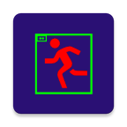

# thermamotion.flirstreaming.pp

Policy Document Number: 01
Last Updated: 28/03/2024

# Privacy Policy for Mobile Application
This privacy policy governs your use of the software application **ThermaMotion** that was
developed by **Mobile Toys & Tools (MTAT)** for mobile devices. The application detects
objects in motion by using a FLIR thermal camera. The application plays sound and plots it
on the screen optionally if there is a motion detected. The application can use the thermal
picture obtained by a FLIR thermal camera therefore runs day and night without any need to
visible light.

# What information does the Application obtain and how is it used?
## Camera Information
**ThermaMotion** captures thermal pictures by using FLIR thermal camera and presents to the
user on device screen. **ThermaMotion** does not transmit any camera information to any
other site or share with third parties. **ThermaMotion** also does not store or process the
images unintentionally for any purpose.

## Contact Information
**ThermaMotion** does not collects or share any Contact Information. **MTAT** also do not use
the information you have provided us for any notices and marketing promotions.

## Phone State
**ThermaMotion** does not automatically collects the Phone State information in devices with
phone sets. **ThermaMotion** does not share your Phone State information with third parties.

## User Provided Information
**ThermaMotion** does not need registration when you download and run the application.
**MTAT** also do not keep any of your sensitive and contact information. **MTAT** also do not
use the information you might have provided us to contact you from time to time to provide
you required notices and marketing promotions.

## Automatically Collected Information
**ThermaMotion** does not collect information from and/or for social networking platforms
(e.g., pulling contact information, friend lists, login information, photos or check-ins). In
addition, **ThermaMotion** does not collect certain information automatically, including, but
not limited to, the type of mobile device you use, your mobile devices unique device ID, the
IP address of your mobile device, your mobile operating system, the type of mobile Internet
browsers you use, and information about the way you use **ThermaMotion**.

# Does the application collect precise real time location information of the device?
No. **ThermaMotion** does not collect precise information about the location of your mobile
device.

# Do third parties see and/or have access to information obtained by the application?
No. Even aggregated, anonymized data is not periodically transmitted to external services.

# Privacy Policy Changes
This Privacy Policy may be updated from time to time for any reason. You are advised to consult this Privacy Policy regularly for any changes, as continued use is deemed approval of all changes. We will also change the “Policy Document Number” at the beginning of this Privacy Policy. Any changes we make to our Privacy Policy are effective as of this number and replace any prior Privacy Policies. You can check the history of this policy by clicking [here](https://drive.google.com/drive/folders/12TLZBf6Y7g59wb6LmjXfheGmBPZI_ARk?usp=drive_link).

# Contact us
If you have any questions regarding privacy while using the application, or have questions about our practices, please contact us via email at [mobile.toys.tools@gmail.com](mobile.toys.tools@gmail.com).
